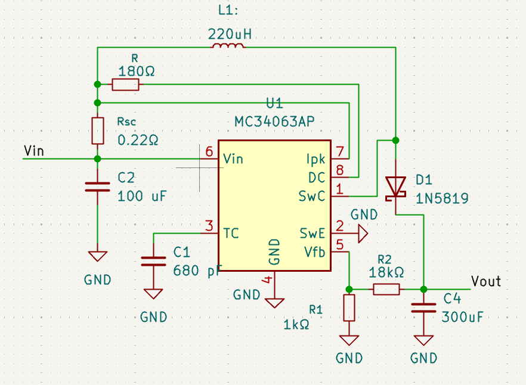
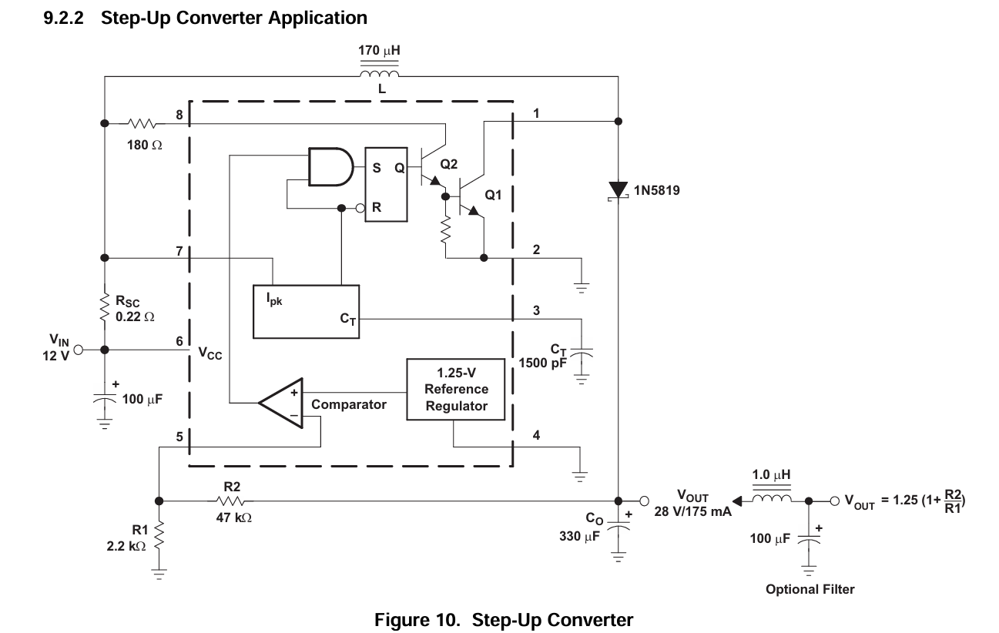

    

# MC34063A Boost Converter

12 V to 24 V step-up converter (250 mA) using the MC34063A, based on Figure 10 of the datasheet. Designed in KiCad.

## Contents
1. [Design Requirements](#design-requirements)
2. [Calculations](#calculations)
3. [Schematic](#schematic)
4. [Files](#files)

---

## Design Requirements

| Parameter | Value |
|---|---|
| Input voltage | 12 V |
| Output voltage | 24 V |
| Output current | 250 mA |
| Min frequency | 30 kHz |
| Ripple | 240 mV |

## Calculations

Full math is in [calculations/README.md](calculations/README.md).

## Schematic Components

| Ref | Part | Calculated | Chosen | How it was chosen |
|---|---|---|---|---|
| U1 | MC34063AP | - | MC34063AP | Datasheet Figure 10 |
| L1 | Inductor | 183 µH min | 220 µH | Calculated |
| D1 | Diode | - | 1N5819 | Datasheet Figure 10 |
| Rsc | Resistor | 0.28 Ω | 0.22 Ω | Calculated |
| R | Resistor (pin 8) | - | 180 Ω | Datasheet Figure 10 |
| R1 | Resistor | - | 1 kΩ | Picked as the divider base value |
| R2 | Resistor | 18.2 kΩ | 18 kΩ | Calculated |
| C1 | Ceramic capacitor | 708 pF | 680 pF | Calculated |
| C2 | Electrolytic capacitor | - | 100 µF | Datasheet Figure 10 |
| C4 | Electrolytic capacitor | 166 µF min | 300 µF | Calculated |

## Schematic

Reference circuit from the datasheet (Figure 10):

## Files

| Item | Location |
|---|---|
| KiCad project | [kicad/](kicad/) |
| Calculations | [calculations/README.md](calculations/README.md) |
| Datasheets | [datasheets/](datasheets/) |