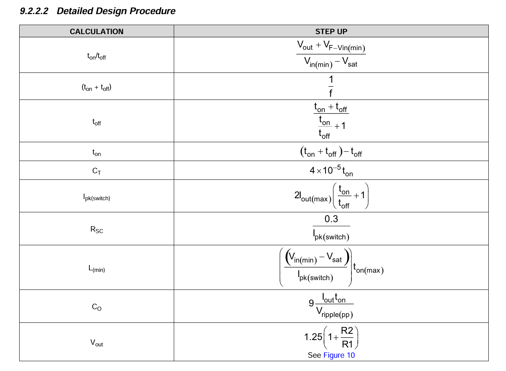

<!-- kicad_template/calculations/README.md -->

    

# MC34063A Boost Converter Calculations
Python script used for calculations: [Calculations_Python.py](Calculations_Python.py)

## Constants

| Symbol | Value | Description |
|---|---|---|
| $V_{in}$ | 12 V | Input voltage (V) |
| $V_{out}$ | 24 V | Output voltage (V) |
| $V_F$ | 0.45 V | Forward voltage of the 1N5819 diode, from datasheet (V) |
| $V_{sat}$ | 1.0 V | Saturation voltage (V) |
| $f$ | 30 kHz | Frequency (Hz) |
| $I_{out}$ | 250 mA | Maximum output current (A) |
| $V_{ripple}$ | 240 mV | Min ripple voltage (V) |

## Timing

$$\frac{t_{on}}{t_{off}} = \frac{V_{out}+V_F-V_{in}}{V_{in}-V_{sat}} = \frac{24+0.45-12}{12-1} = 1.132$$

$$t_{on}+t_{off} = \frac{1}{f} = \frac{1}{30\text{ kHz}} = 33.3\ \mu s$$

$$t_{off} = \frac{33.3\ \mu s}{1.132+1} = 15.6\ \mu s$$

$$t_{on} = 33.3\ \mu s - 15.6\ \mu s = 17.7\ \mu s$$

## Timing Capacitor (C1)

$$C_T = 4\times10^{-5}\,t_{on} = 4\times10^{-5}(17.7\ \mu s) = 708\text{ pF}$$

**Chosen: 680 pF**

$$t_{on} = \frac{680\text{ pF}}{4\times10^{-5}} = 17.0\ \mu s,\quad t_{off} = \frac{17.0\ \mu s}{1.132} = 15.0\ \mu s,\quad f = \frac{1}{32.0\ \mu s} = 31.2\text{ kHz}$$

## Peak Current and Sense Resistor (Rsc)

$$I_{pk} = 2 I_{out}\left(\frac{t_{on}}{t_{off}}+1\right) = 2(0.25)(2.132) = 1.07\text{ A}$$

$$R_{SC} = \frac{0.3}{I_{pk}} = \frac{0.3}{1.07} = 0.28\ \Omega$$

**Chosen: 0.22 Ω**

$$I_{limit} = \frac{0.3}{0.22} = 1.36\text{ A}$$

## Inductor (L1)

$$L_{min} = \frac{V_{in}-V_{sat}}{I_{pk}}\,t_{on} = \frac{11}{1.07}(17.7\ \mu s) = 183\ \mu H$$

**Chosen: 220 µH**

## Output Capacitor (C4)

$$C_O = 9\,\frac{I_{out}\,t_{on}}{V_{ripple}} = 9\,\frac{(0.25)(17.7\ \mu s)}{0.24} = 166\ \mu F$$

**Chosen: 300 µF**

$$V_{ripple} = 9\,\frac{I_{out}\,t_{on}}{C_O} = 9\,\frac{(0.25)(17.7\ \mu s)}{300\ \mu F} = 133\text{ mV}$$

## Feedback Divider (R1, R2)

$$V_{out} = 1.25\left(1+\frac{R_2}{R_1}\right)$$

$$R_2 = R_1\left(\frac{V_{out}}{1.25}-1\right) = 1000\left(\frac{24}{1.25}-1\right) = 18.2\text{ k}\Omega$$

**Chosen: R1 = 1 kΩ, R2 = 18 kΩ**

$$V_{out} = 1.25\left(1+\frac{18\text{ k}}{1\text{ k}}\right) = 23.75\text{ V}$$

## Schematic Components

| Ref | Part | Calculated | Chosen | How it was chosen |
|---|---|---|---|---|
| U1 | MC34063AP | - | MC34063AP | Datasheet layout |
| L1 | Inductor | 183 µH min | 220 µH | Calculated |
| D1 | Diode | - | 1N5819 | Datasheet layout |
| Rsc | Resistor | 0.28 Ω | 0.22 Ω | Calculated |
| R | Resistor (pin 8) | - | 180 Ω | Datasheet layout |
| R1 | Resistor | - | 1 kΩ | Picked as the divider base value |
| R2 | Resistor | 18.2 kΩ | 18 kΩ | Calculated |
| C1 | Ceramic capacitor | 708 pF | 680 pF | Calculated |
| C2 | Electrolytic capacitor | - | 100 µF | Datasheet layout |
| C4 | Electrolytic capacitor | 166 µF min | 300 µF | Calculated |

Formulas used for the calculations:
